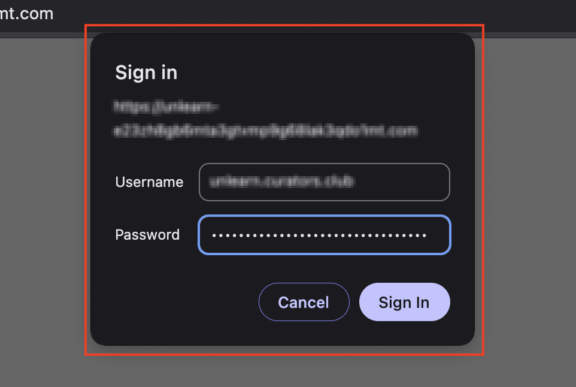
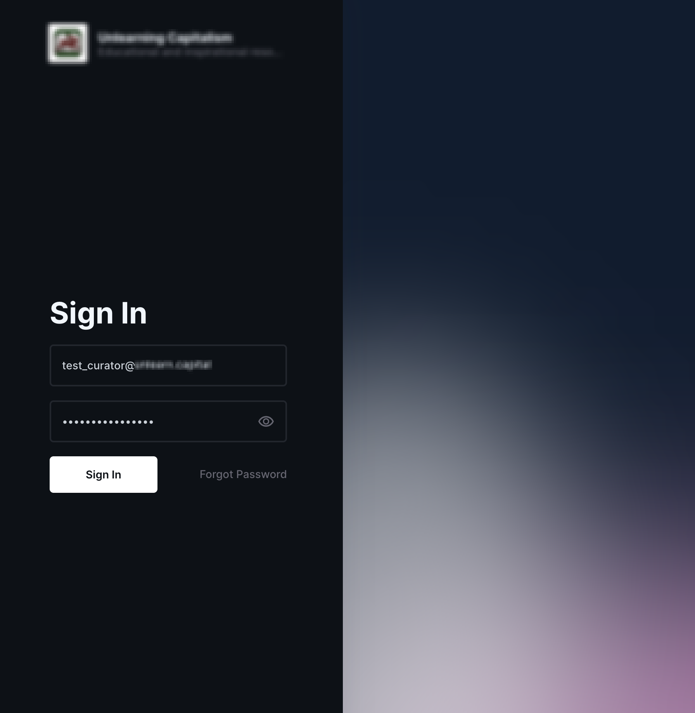
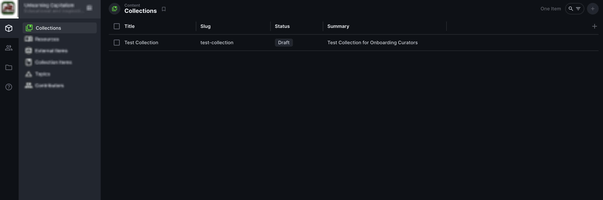
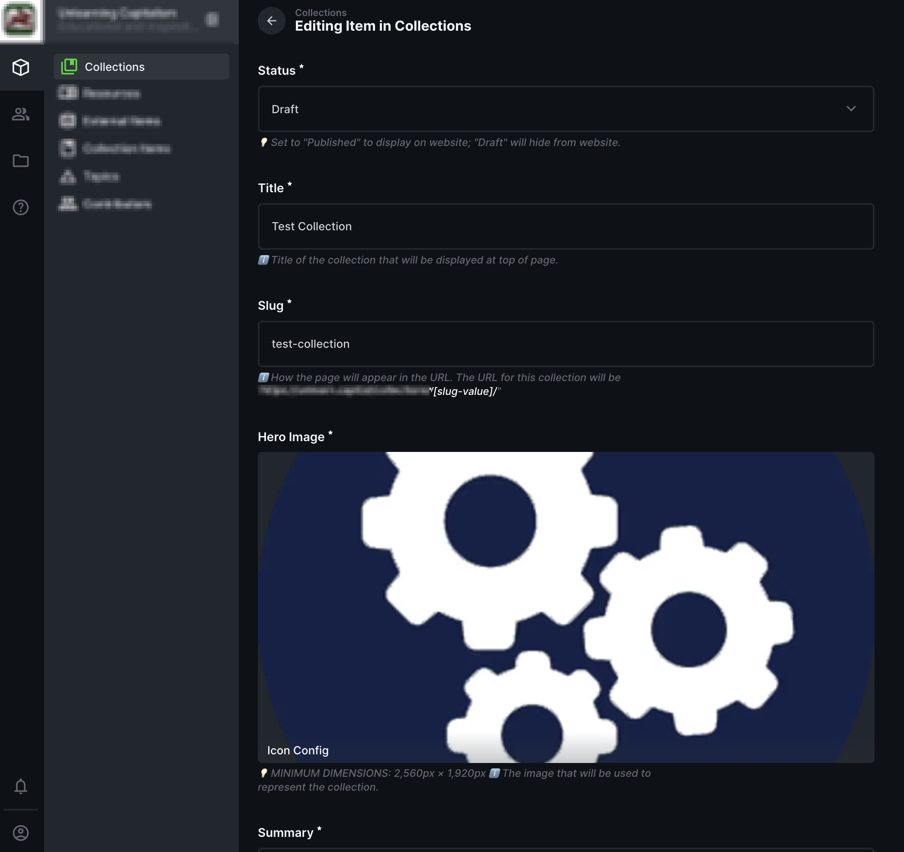
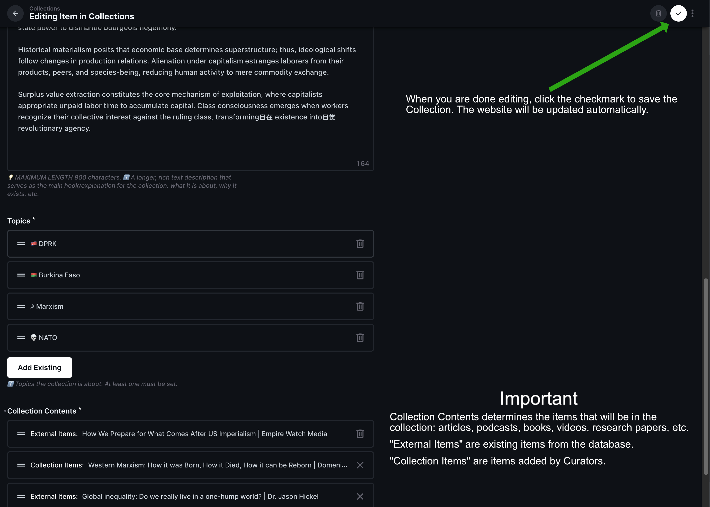

# Curator guide: accessing the Directus admin console

This guide is for **Curators** — people who help edit collection content for the website.
> 💡 **You will need the following which will be sent securely to you separately:**
> 1. The URL to the admin console.
> 2. Your username and password for Basic Authentication.
> 3. Your Directus email and temporary password.
> >

**The admin console is protected by two layers of security.**

## 1️⃣ Step 1: Basic Authentication

First, you will see a **Basic Auth** dialog when you open the site.

1. In your web browser, go to the URL we sent you.
2. A dialog will appear asking for **username** and **password**.

  

1. Enter the **username** and **password** we sent you (this is separate from your Directus login).
2. Click **Sign in** or press Enter.

> 💡 **Tip:** If the dialog does not appear or you see "401 Unauthorized", try refreshing the page. If you still cannot access it, contact me.

## 2️⃣ Step 2: Directus Login

After passing Basic Auth, you will see the **Directus login** screen.

  

1. Enter the **email** and **password** you received.
2. Click **Sign in**.

---

## 3️⃣ Step 3: Editing Collections

1. Once you are logged in, you will see the Directus **admin dashboard**.
2. Click on Collections in the left sidebar.

  

3. You will see the Collections page. Here you can see all the fields in the Collections that you can edit.

  

### Editable Fields in Collections

> 💡 **All fields are required. You will not be able to save the collection without filling in all the fields.**

| Field                   | Description                                                                                                                                                                                                             |
| ----------------------- | ----------------------------------------------------------------------------------------------------------------------------------------------------------------------------------------------------------------------- |
| **Status**              | The status of the collection. Set to "Published" to make the collection live on the website or "Draft" to keep it hidden.                                                                                               |
| **Title**               | The collection title                                                                                                                                                                                                    |
| **Slug**                | URL-friendly identifier for the collection (eg "test-collection")                                                                                                                                                       |
| **Hero Image**          | **💡 MINIMUM WIDTH: 2,560px, MINMUM HEIGHT: 1,920px** — Wide banner image for the collection page                                                                                                                        |  |
| **Summary**             | A short summary (max 255 characters) displayed on cards                                                                                                                                                                 |
| **Description**         | A longer description (max 900 characters) with formatting tools for the main explanation of the collection                                                                                                              |
| **Topics**              | Topics the collection is about. At least one must be set (e.g., Geopolitics, Economics, Agriculture, Philosophy)                                                                                                        |
| **Collection Contents** | **‼️ The main contents of the collection** — articles, podcasts, videos, books, papers. Can be **"External Items"** (existing searchable database items) and/or **"Collection Items"** (external links you add yourself) |

4. When you are done editing the collection, save the collection by clicking the checkmark button in the top right corner.

  

## Getting help

Contact me if if you run into any issues.
